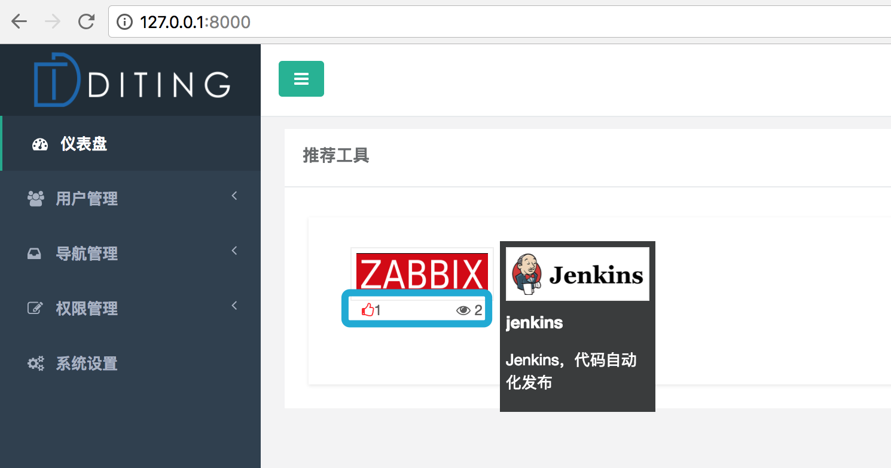
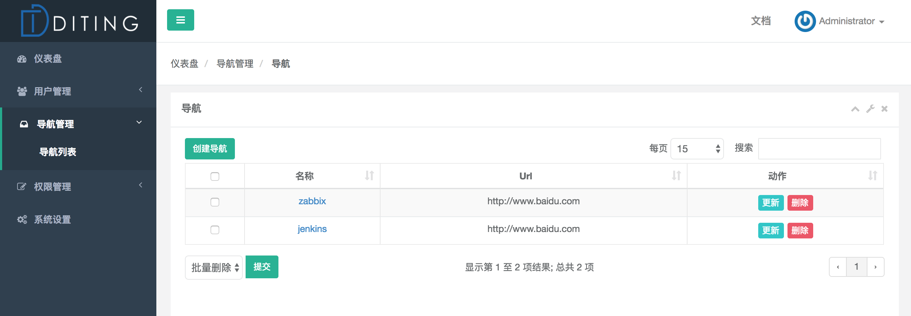
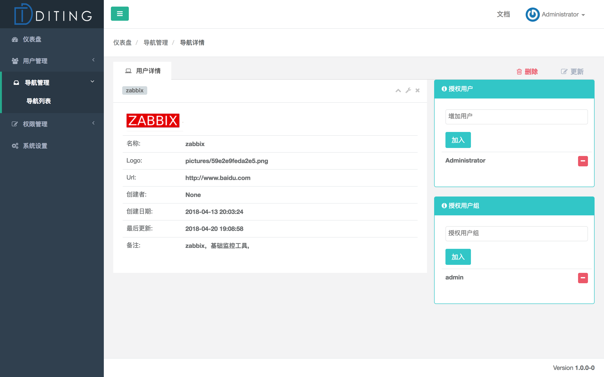
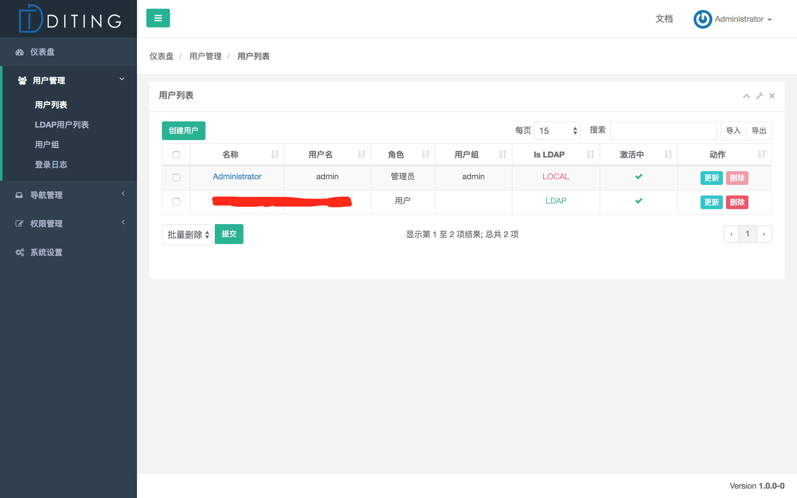

## Diting 谛听系统
目标：让运维更简单

目前在jumpserver的框架下，开始项目
### 1 当前功能：
* 用户管理-用户增删改查
* 运维导航-快速链接、导航面板管理-增删改查
* 统一账户体系，支持LDAP登录、本地用户登录，开启LDAP的情况下，用户改密码实时同步到LDAP，新增用户直接可以添加到LDAP账户体系中
* LDAP账户修改一些属性同步到LDAP
### 2 待添加功能
* 导航权限分配
* 支持接入开源没有账户体系的系统
* 其他

欢迎有兴趣的同学一起开发，这里感谢[Jumpserver](https://github.com/jumpserver/)这么好的项目，借用了框架。


[](#)

[](#)

[](#)

[](#)


## 3 安装说明
需要基本环境Python3.6
项目路径: {install path}
首先配置config.py 主要配置数据库地址

### 3.1 系统环境设置
```shell
# CentOS 7
$ setenforce 0  # 可以设置配置文件永久关闭
$ systemctl stop iptables.service
$ systemctl stop firewalld.service

# 修改字符集，否则可能报 input/output error的问题，因为日志里打印了中文
$ localedef -c -f UTF-8 -i zh_CN zh_CN.UTF-8
$ export LC_ALL=zh_CN.UTF-8
$ echo 'LANG=zh_CN.UTF-8' > /etc/locale.conf

# CentOS6
$ setenforce 0
$ service iptables stop

# 修改字符集，否则可能报 input/output error的问题，因为日志里打印了中文
$ localedef -c -f UTF-8 -i zh_CN zh_CN.UTF-8
$ export LC_ALL=zh_CN.UTF-8
$ echo 'LANG=zh_CN.UTF-8' > /etc/sysconfig/i18n
```

### 3.2 准备 Python3 和 Python 虚拟环境
```shell
$ yum groupinstall "Development tools" -y
#安装系统依赖
$ yum -y install wget sqlite-devel xz gcc automake zlib-devel openssl-devel epel-release git python-ldap openldap-devel python-devel

#安装python3.6
$ wget https://www.python.org/ftp/python/3.6.1/Python-3.6.1.tar.xz
$ tar xvf Python-3.6.1.tar.xz  && cd Python-3.6.1
$ ./configure && make && make install
# 这里必须执行编译安装，否则在安装 Python 库依赖时会有麻烦...

# 使用虚拟环境
$ /usr/local/bin/python3.6 -m venv /opt/venv3
$ source /opt/venv3/bin/active
#注意：当出现(venv3)时候，表示虚拟环境生成成功
$ (venv3) [root@xxx xxx]#
```

### 3.3 安装谛听(diting)

```shell
#进入到安装目录/opt
$ cd /opt
$ git clone https://github.com/getway/diting.git
$ cd diting
# 安装依赖
$ pip install -r requirements/requirements.txt
# 数据库迁移(初始化数据库)
$ cd /opt/diting/utils
$ python3 ../apps/manage.py makemigrations common users perms navis likes
$ bash make_migrations.sh
#导入数据
$ cd /opt/diting/apps
$ python manage.py loaddata fixtures/init.json


```

### 3.4 服务启动

```shell
$ cd /opt/diting
直接启动：
$ ./dt start
#或后台启动
$ ./dt start -d

# 访问
http://127.0.0.1:8080
用户名 ： admin
密码： admin

```

### 3.5 nginx配置
生产环境，请把配置中DEBUG改为False
```
#nginx配置文件
server {
	listen 80;
	listen 443 ssl http2;
	server_name 域名; #配置自己的域名

	#https配置，没有的可以忽略
	#ssl on;
	#ssl_certificate ***.cer;  #替换为自己的路径
	#ssl_certificate_key ***.key; #替换为自己的路径
	#ssl_session_timeout 5m;
	#ssl_ciphers ECDHE-RSA-AES128-GCM-SHA256:ECDHE:ECDH:AES:HIGH:!NULL:!aNULL:!MD5:!ADH:!RC4;
	#ssl_protocols TLSv1 TLSv1.1 TLSv1.2;
	#ssl_prefer_server_ciphers on;

	index index.html index.htm index.php;

	proxy_set_header X-Real-IP $remote_addr;
	proxy_set_header Host $host;
	proxy_set_header X-Forwarded-For $proxy_add_x_forwarded_for;

	location /media/ {
		root /opt/diting/data/;
	}

	location /static/ {
		root /opt/diting/data/;
	}

	location / {
		proxy_pass http://localhost:8080;
	}

}
```


