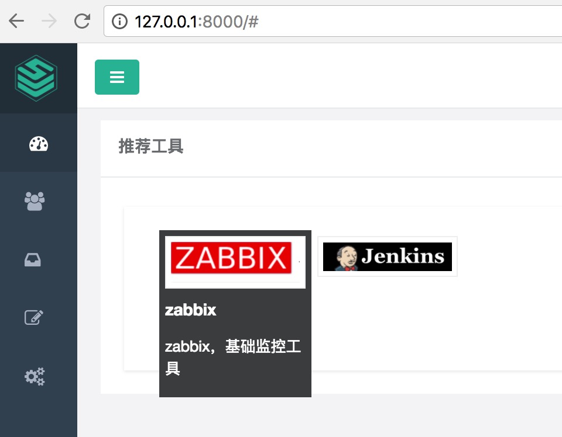
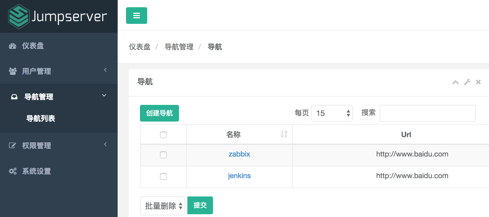
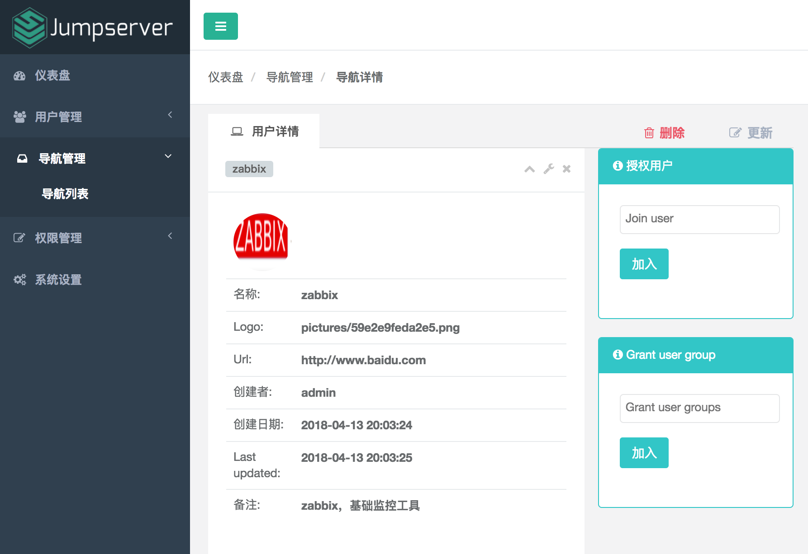
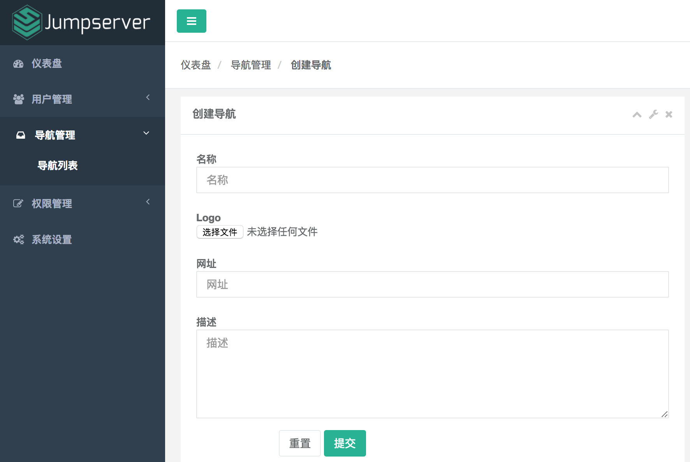

## Diting 谛听系统
目标：让运维更简单

目前在jumpserver的框架下，开始项目
当前集成运维导航：

[](https://www.python.org/)

[](https://www.python.org/)

[](https://www.python.org/)

[](https://www.python.org/)

## 安装说明
需要基本环境Python3.6
项目路径: {install path}
首先配置config.py 主要配置数据库地址

```
cd {install path}/
#安装依赖
pip install -r requirements/requirements.txt
#生成数据库
python3 ../apps/manage.py makemigrations
python3 ../apps/manage.py migrate
#启动
python3 run_server.py
```
